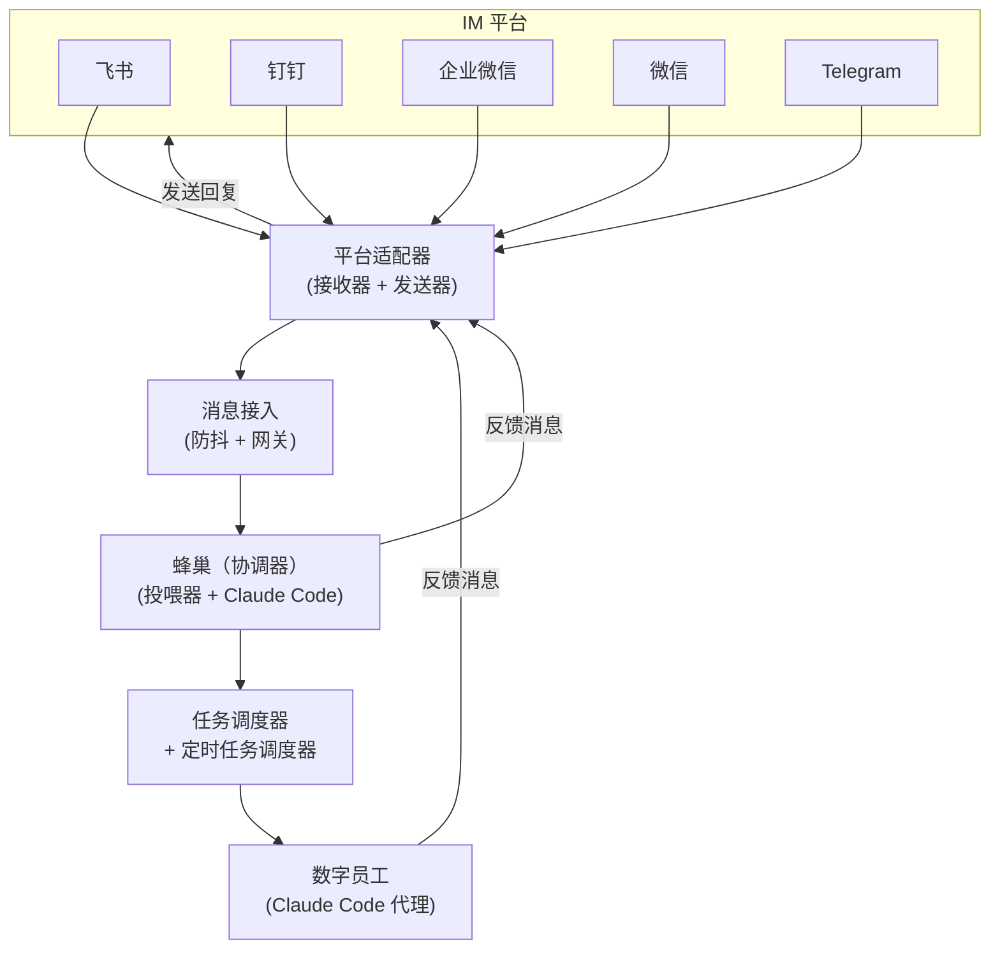

## 概述

OpenBee 是一个模块化的 Go 应用，配有 React 前端。后端处理消息路由、任务调度、数字员工管理和 Claude Code 集成。

## 系统架构

## 消息流

1. **平台接收器** — 每个平台适配器通过其协议（webhook、流式、WebSocket 或轮询）监听传入消息
2. **消息接入** — 网关对快速消息进行防抖处理（默认 3 秒窗口）并存储到数据库
3. **蜂巢投喂器** — 每 5 秒轮询未处理的消息，按会话键分组，调用蜂巢（Claude Code 协调器）
4. **蜂巢协调器** — 一个 Claude Code 进程，读取消息并决定由哪个数字员工处理，相应地创建任务
5. **任务调度器** — 拾取待处理的任务并路由到指定的数字员工
6. **数字员工执行** — 启动一个 Claude Code CLI 子进程，使用数字员工的 CLAUDE.md 和工作目录。数字员工通过 MCP 工具与系统交互。
7. **响应** — 数字员工通过 MCP 调用 `send_message`，将回复通过平台适配器路由回去

## 核心组件

### 平台适配器（`internal/platform/`）

每个平台实现 `Receiver` 和 `Sender` 接口：
- **Receiver**：监听来自平台的传入消息
- **Sender**：将回复发送回平台

### 消息接入（`internal/msgingest/`）

`Gateway` 在可配置的防抖窗口内聚合快速消息，然后转发给蜂巢。

### 蜂巢（`internal/bee/`）

`Feeder` 是核心组件：
- 轮询 `platform_messages` 表获取未处理的消息
- 按会话键分组消息
- 调用 Claude Code 作为蜂巢协调器
- 管理会话连续性（恢复已有会话）
- 处理故障恢复和重试

### Claude Code 集成（`internal/claude/`）

`Invoker` 将 Claude Code CLI 作为子进程启动：
- 传递包含 CLAUDE.md 的工作目录作为系统提示词
- 通过 stdout/stderr 流进行通信
- 支持通过 `--resume` 标志恢复会话
- 连接到 MCP 服务器进行工具调用

### 任务系统（`internal/task_dispatcher/`、`internal/task_scheduler/`）

- **调度器**：管理每个数字员工的执行队列，确保每个数字员工同时只执行一个任务
- **定时调度器**：轮询倒计时和 cron 任务，在正确的时间触发它们

### 数据层（`internal/store/`）

基于 SQLite 的持久化存储，表名以 `bee_` 为前缀：
- `bee_workers`、`bee_tasks`、`bee_executions`、`bee_messages`、`bee_sessions`、`bee_memory`

### MCP 服务器（`internal/mcp/`）

通过 SSE 传输协议在 `/mcp/sse` 暴露 19 个工具。使用 API 密钥认证。在 Claude Code CLI 执行期间供蜂巢和数字员工使用。

## 并发模型

- 蜂巢投喂器和任务调度器作为独立的 goroutine 运行
- 每个平台接收器在自己的 goroutine 中运行
- 数字员工执行是隔离的进程（Claude Code CLI 子进程）
- 使用 `golang.org/x/sync` 实现结构化并发
- 收到 SIGINT/SIGTERM 时进行优雅关闭，超时时间为 15 秒
