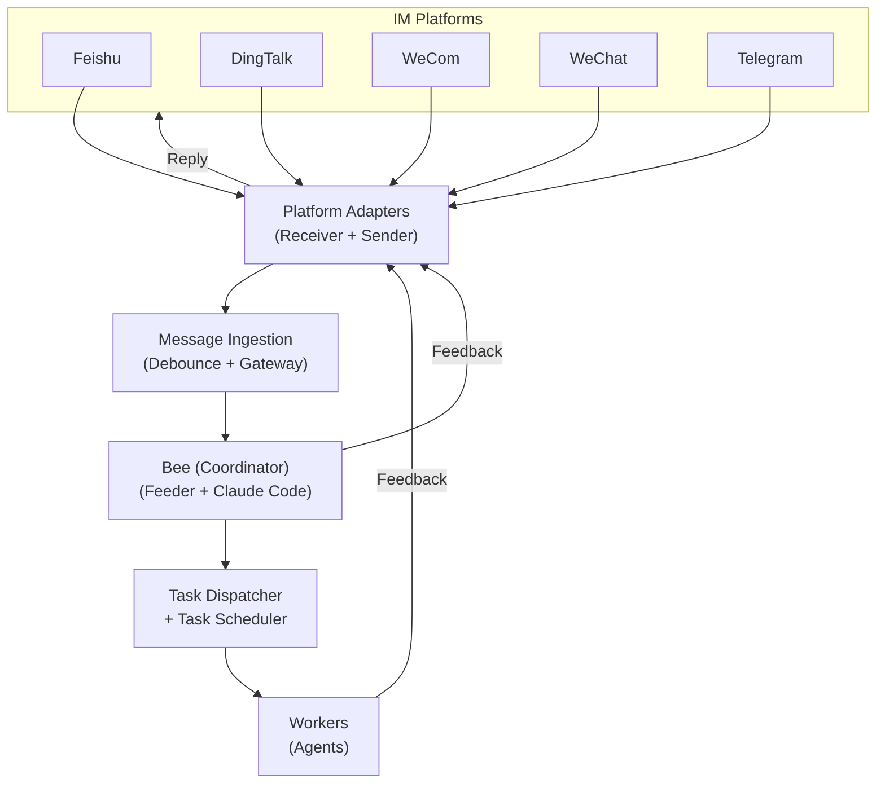

## Overview

OpenBee is built as a modular Go application with a React frontend. The backend handles message routing, task scheduling, worker management, and Claude Code integration.

## System Architecture

## Message Flow

1. **Platform Receiver** — Each platform adapter listens for incoming messages via its protocol (webhook, streaming, WebSocket, or polling)
2. **Message Ingestion** — The gateway debounces rapid messages (default 3s window) and stores them in the database
3. **Bee Feeder** — Polls for unprocessed messages every 5 seconds, groups by session key, and invokes the bee (Claude Code coordinator)
4. **Bee Coordinator** — A Claude Code process that reads the message and decides which worker should handle it, creates tasks accordingly
5. **Task Dispatcher** — Picks up pending tasks and routes them to the assigned worker
6. **Worker Execution** — Spawns a Claude Code CLI subprocess with the worker's CLAUDE.md and working directory. The worker uses MCP tools to interact with the system.
7. **Response** — The worker calls `send_message` via MCP, which routes the reply back through the platform adapter

## Key Components

### Platform Adapters (`internal/platform/`)

Each platform implements the `Receiver` and `Sender` interfaces:
- **Receiver**: Listens for incoming messages from the platform
- **Sender**: Sends replies back to the platform

### Message Ingestion (`internal/msgingest/`)

The `Gateway` aggregates rapid messages within a configurable debounce window before forwarding to the bee.

### Bee (`internal/bee/`)

The `Feeder` is the core component:
- Polls the `platform_messages` table for unprocessed messages
- Groups messages by session key
- Invokes Claude Code as the bee coordinator
- Manages session continuity (resume existing sessions)
- Handles failure recovery and retries

### Claude Code Integration (`internal/claude/`)

The `Invoker` spawns Claude Code CLI as subprocesses:
- Passes working directory with CLAUDE.md for system prompt
- Communicates via stdout/stderr streams
- Supports session resumption via `--resume` flag
- Connects to the MCP server for tool invocation

### Task System (`internal/task_dispatcher/`, `internal/task_scheduler/`)

- **Dispatcher**: Manages per-worker execution queues, ensures one task per worker at a time
- **Scheduler**: Polls for countdown and cron tasks, triggers them at the right time

### Data Layer (`internal/store/`)

SQLite-based persistence with tables prefixed `bee_`:
- `bee_workers`, `bee_tasks`, `bee_executions`, `bee_messages`, `bee_sessions`, `bee_memory`

### MCP Server (`internal/mcp/`)

Exposes 19 tools via SSE transport at `/mcp/sse`. Authenticated with API key. Used by both bee and workers during Claude Code CLI execution.

## Concurrency Model

- The bee feeder and task scheduler run as independent goroutines
- Each platform receiver runs in its own goroutine
- Worker executions are isolated processes (Claude Code CLI subprocesses)
- `golang.org/x/sync` is used for structured concurrency
- Graceful shutdown with 15-second timeout on SIGINT/SIGTERM
