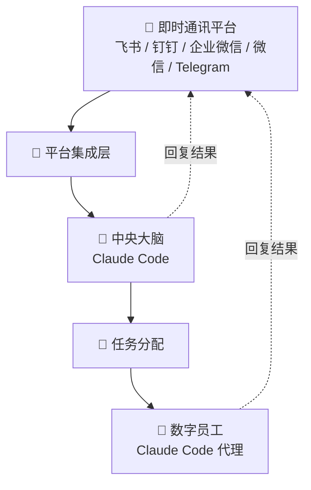

OpenBee 是一个数字员工解决方案，将 Claude Code 作为自主数字员工运行。每个数字员工都能够进行多步骤任务规划和独立执行，通过你现有的即时通讯平台进行沟通。

## 核心特性

- **AI 数字员工** — 具有持久记忆和 MCP 工具调用能力的 Claude Code 代理
- **多平台支持** — 飞书、钉钉、企业微信和 Telegram
- **任务调度** — 即时执行、倒计时和基于 cron 的定时任务
- **Web 控制台** — 管理数字员工、监控任务、查看执行日志
- **MCP 工具** — 可扩展的工具系统，增强数字员工能力
- **持久记忆** — 数字员工跨会话记住上下文

## 工作原理

用户通过即时通讯平台发送消息。OpenBee 将消息路由到对应的数字员工，数字员工使用 Claude Code 来规划和执行任务。数字员工可以调用 MCP 工具、管理自己的记忆，并安排后续任务。

## 下一步

<Cards>
  <Card title="安装" href="/cn/docs/guide/installation" />
  <Card title="快速开始" href="/cn/docs/guide/quick-start" />
  <Card title="架构概览" href="/cn/docs/developer/architecture" />
</Cards>
