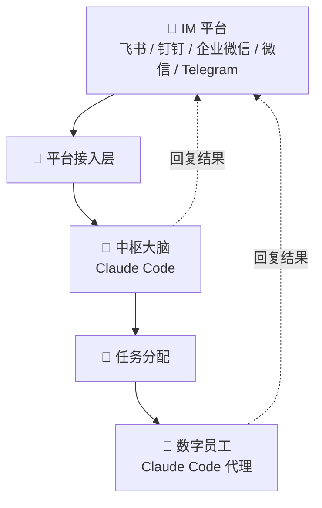

OpenBee 是一个数字员工解决方案，将 Claude Code 作为自主数字员工运行。每个数字员工都能够进行多步骤任务规划和独立执行，通过你现有的即时通讯平台进行沟通。

## 核心特性

- **AI 数字员工** — 具有持久记忆和 MCP 工具调用能力的 Claude Code 代理
- **多平台支持** — 飞书、钉钉、企业微信和 Telegram
- **任务调度** — 即时执行、倒计时和基于 cron 的定时任务
- **Web 控制台** — 管理数字员工、监控任务、查看执行日志
- **MCP 工具** — 可扩展的工具系统，增强数字员工能力
- **持久记忆** — 数字员工跨会话记住上下文

## 工作原理

- **IM 平台**：飞书、钉钉、企业微信、微信、Telegram，是用户发起对话的入口，消息经由平台接入层进入系统。
- **平台接入层**：统一对接各 IM 平台的消息协议，将消息转发给中枢大脑处理。
- **中枢大脑（Claude Code）**：系统核心，负责理解消息意图。简单请求可直接回复 IM 平台；复杂任务则生成任务指令，交由任务分配环节处理。
- **任务分配**：将具体任务下发给合适的数字员工执行。
- **数字员工**：独立的 Claude Code 代理，接收任务后进行多步骤规划和自主执行，完成后将结果回传给 IM 平台。

## 下一步

<Cards>
  <Card title="安装" href="/cn/docs/guide/installation" />
  <Card title="快速开始" href="/cn/docs/guide/quick-start" />
  <Card title="架构概览" href="/cn/docs/developer/architecture" />
</Cards>

## 社区交流

加入 QQ 群，获取帮助、分享反馈，与其他 OpenBee 用户交流。

**群号：675097974**

