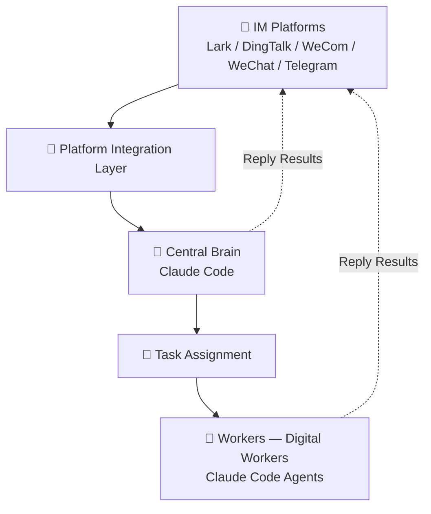

OpenBee is a digital worker solution that runs Claude Code as autonomous workers. Each worker is capable of multi-step task planning and independent execution, communicating through your existing IM platforms.

## Key Features

- **AI Workers** — Claude Code agents with persistent memory and MCP tool invocation
- **Multi-IM Support** — Lark (Feishu), DingTalk, WeCom, and Telegram
- **Task Scheduling** — Immediate, countdown, and cron-based recurring tasks
- **Web Console** — Manage workers, monitor tasks, and view execution logs
- **MCP Tools** — Extensible tool system for worker capabilities
- **Persistent Memory** — Workers remember context across sessions

## How It Works

- **IM Platforms**: Lark, DingTalk, WeCom, WeChat, and Telegram — the entry point for user conversations, with messages routed into the system via the Platform Integration Layer.
- **Platform Integration Layer**: Handles protocol translation and message routing across all supported IM platforms, forwarding messages to the Central Brain.
- **Central Brain (Claude Code)**: The system's core intelligence. Simple requests are answered directly back to the IM platforms; complex tasks are broken down into instructions and passed to Task Assignment.
- **Task Assignment**: Dispatches specific tasks to the appropriate digital workers for execution.
- **Workers (Digital Workers)**: Independent Claude Code agents that receive tasks, perform multi-step planning and autonomous execution, then send results back to the IM platforms.

## Next Steps

<Cards>
  <Card title="Installation" href="/docs/guide/installation" />
  <Card title="Quick Start" href="/docs/guide/quick-start" />
  <Card title="Architecture" href="/docs/developer/architecture" />
</Cards>

## Community

Join our QQ group to get help, share feedback, and connect with other OpenBee users.

**Group number: 675097974**

