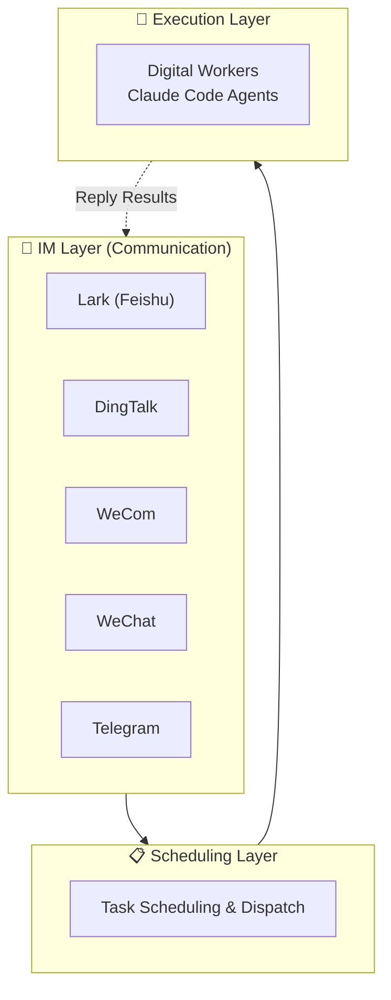

OpenBee is a digital worker solution that runs Claude Code as autonomous workers. Each worker is capable of multi-step task planning and independent execution, communicating through your existing IM platforms.

## Key Features

- **AI Workers** — Claude Code agents with persistent memory and MCP tool invocation
- **Multi-IM Support** — Lark (Feishu), DingTalk, WeCom, and Telegram
- **Task Scheduling** — Immediate, countdown, and cron-based recurring tasks
- **Web Console** — Manage workers, monitor tasks, and view execution logs
- **MCP Tools** — Extensible tool system for worker capabilities
- **Persistent Memory** — Workers remember context across sessions

## How It Works

OpenBee uses a three-layer architecture that cleanly separates communication, scheduling, and execution:

- **IM Layer (Communication)**: Users send messages via Lark, DingTalk, WeCom, WeChat, or Telegram. OpenBee connects to each platform's messaging interface.
- **Scheduling Layer**: Receives messages from the IM layer, interprets task intent, and dispatches tasks to the appropriate digital workers.
- **Execution Layer**: Workers receive tasks and use Claude Code to plan and execute them autonomously, then return results to the user.

## Next Steps

<Cards>
  <Card title="Installation" href="/docs/guide/installation" />
  <Card title="Quick Start" href="/docs/guide/quick-start" />
  <Card title="Architecture" href="/docs/developer/architecture" />
</Cards>

## Community

Join our QQ group to get help, share feedback, and connect with other OpenBee users.

**Group number: 675097974**

