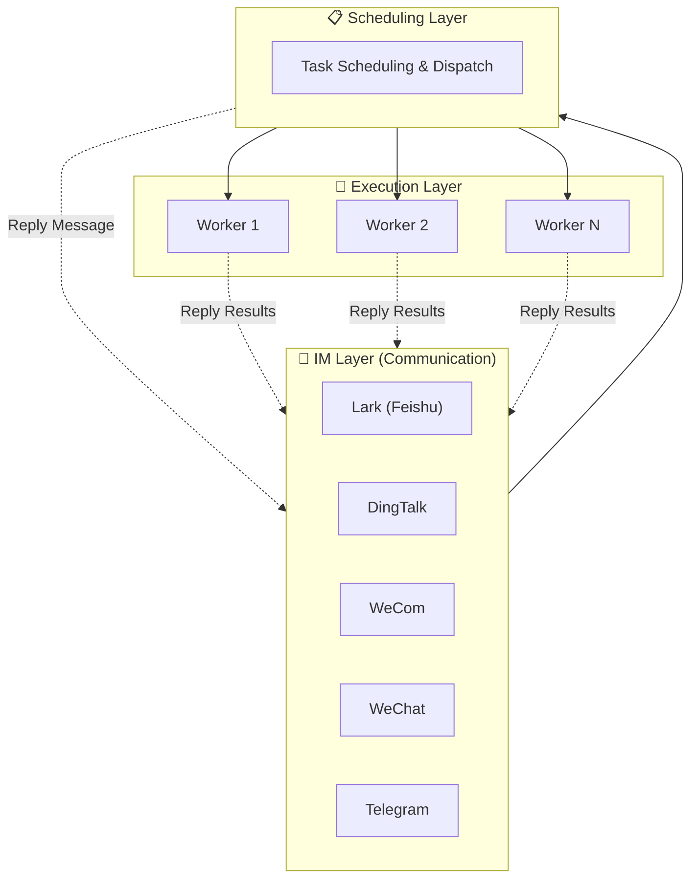

OpenBee is a digital worker solution that runs Claude Code as autonomous workers. Each worker is capable of multi-step task planning and independent execution, communicating through your existing IM platforms.

## Key Features

- **AI Workers** — Claude Code agents with persistent memory and MCP tool invocation
- **Multi-IM Support** — Lark (Feishu), DingTalk, WeCom, and Telegram
- **Task Scheduling** — Immediate, countdown, and cron-based recurring tasks
- **Web Console** — Manage workers, monitor tasks, and view execution logs
- **MCP Tools** — Extensible tool system for worker capabilities
- **Persistent Memory** — Workers remember context across sessions

## How It Works

OpenBee uses a three-layer architecture that cleanly separates communication, scheduling, and execution:

- **IM Layer (Communication)**: The topmost layer and the entry point for all user interactions. Users send messages via Lark, DingTalk, WeCom, WeChat, or Telegram, which are passed down to the scheduling layer.
- **Scheduling Layer**: Receives messages from the IM layer and takes one of two paths: reply directly back to the IM layer (e.g., for simple queries), or dispatch tasks to workers in the execution layer. The scheduling layer can manage multiple workers simultaneously, enabling parallel task processing.
- **Execution Layer**: Composed of multiple independent workers, each a Claude Code agent capable of multi-step planning and autonomous execution. Once a task is complete, each worker sends results directly back to the IM layer for delivery to the user.

## Next Steps

<Cards>
  <Card title="Installation" href="/docs/guide/installation" />
  <Card title="Quick Start" href="/docs/guide/quick-start" />
  <Card title="Architecture" href="/docs/developer/architecture" />
</Cards>

## Community

Join our QQ group to get help, share feedback, and connect with other OpenBee users.

**Group number: 675097974**

